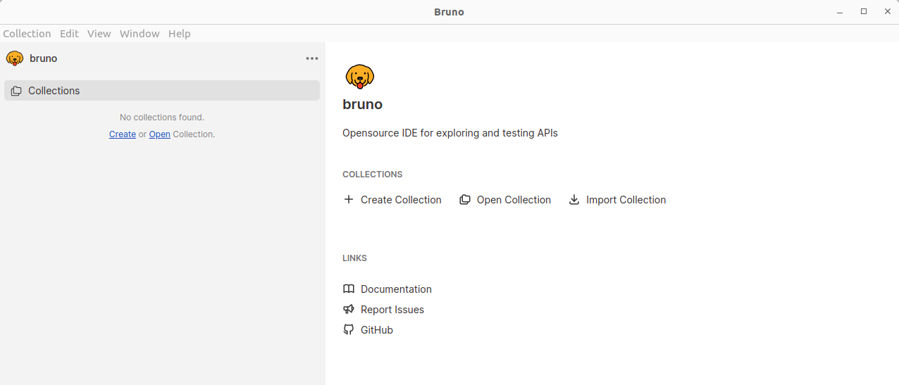

<h1 align="center"> Apis Greenn</h1>

Este projeto utiliza o Bruno para gerenciar e executar coleções de APIs. Bruno é uma ferramenta moderna de gerenciamento de APIs que pode ser utilizada tanto via linha de comando quanto via aplicação gráfica.


## Pré-requisitos
Node.js (18) instalado na sua máquina.


### 🚀 Instalação 

Clonar projeto

```
Para ter acesso aos arquivos de Bruno, basta acessar a pasta do projeto onde será modificado os itens.
Por exemplo, será modificado itens da API no Greenn Back, dentro do projeto terá uma pasta chamada "bruno-api".

*caso o projeto não tenha essa pasta, comunique para implementarmos o Bruno no mesmo.
```

Instalar o Bru CLI no repositório

```bash
 npm install -g @usebruno/cli
 ```

Instalar demais dependências
 ```bash
bru install
```

 ```bash
npm install
```

Verificar versão
```bash
bru --version
```

# Importar a Coleção
Após acessar o projeto, você pode realizar as modificações pelo VSCode ou pelo app Bruno.

### Instalar App 
Realizar download do App Bruno;
https://www.usebruno.com/downloads

### Abrir arquivos no App
Na página inicial do App > "Open Collection" > Abrir a pasta onde o projeto está localizado (Abrir pasta bruno-api).


 Vídeo mostrando o fluxo de abrir a Collection. <a href="https://vimeo.com/990549898/902c68a8ac">Clique aqui</a> 

### Terminal
Utilize o terminal, afim de conseguir puxar/subir alterações em seu projeto de forma fácil e rápido;

<strong> Basta acessar o terminal a partir da pasta clonada com o projeto  e realizar ações com comandos Git</strong>


### VSCode
Utilize o projeto do Bruno no VSCode para gerenciar e executar suas coleções diretamente do editor;

<strong> Basta acessar o VSCode e abrir a pasta que contem o conteúdo clonado;
</strong> 

# Comandos

Conseguimos rodar facilmente e rapidamente os testes de API diretamente pelo terminal, onde temos alguns comandos como:

*Dentro da raiz do projeto, navegar até a pasta do bruno-api

```shell
cd bruno-api
```

Rodar projeto, definindo pasta e env(variavel especifica)
```shell
bru run {{nome da pasta}} --env {{nome da variavel}}
```
Exemplo:
```shell
bru run Regressao/GreennAdm/Login/ --env Servidor-4
```